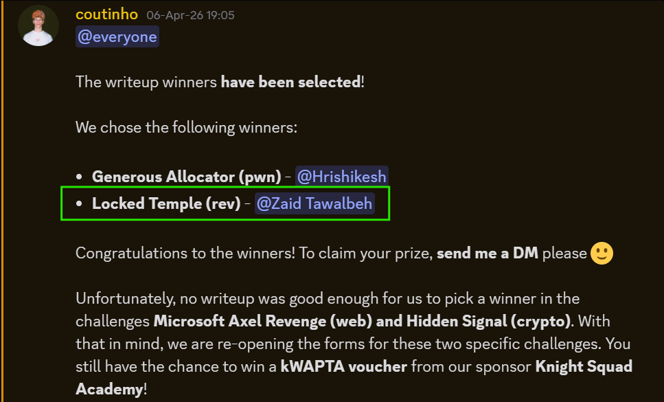

<!-- NEW HERO SECTION START -->

  

<!-- NEW HERO SECTION END -->

<!-- HERO QUICK LINKS START -->

  <a href="https://github.com/0xAeterNova/">GitHub</a> •
  <a href="https://www.linkedin.com/in/zaidtawalbeh/">LinkedIn</a> •
  <a href="https://ctftime.org/user/245368">CTFtime</a> •
  <a href="https://linktr.ee/0xAeterNova">LinkTree</a>

<!-- HERO QUICK LINKS END -->

  
  

# 💫 About Me 
I am a passionate and multidisciplinary student specializing in Robotics and Artificial Intelligence, with a dedication to advancing innovation where technology meets human progress. My academic journey is centered on developing intelligent systems, integrating advanced AI algorithms, and designing robotics solutions that address complex, real-world challenges. My approach combines technical excellence with creativity, leveraging my background in mathematics, physics, and computer science to solve problems with precision and ingenuity.

My interests extend into cybersecurity, where I focus on secure system architecture, ethical hacking, and data protection. I am fascinated by the intersection of emerging technologies and cybersecurity, striving to ensure that intelligent systems are both robust and resilient against evolving digital threats.

Beyond my core technical pursuits, I am inspired by the potential of AI and robotics in medicine particularly in diagnostics, surgery, and personalized healthcare. My enthusiasm for video games reflects an appreciation for sophisticated design, simulation, and their applications in technology-driven education. I am also driven by a passion for space exploration, exploring how advanced robotics and AI can push the boundaries of discovery and extend humanity’s reach into the cosmos.

I am committed to contributing meaningful solutions that enhance lives and address global challenges. I thrive in collaborative, innovative environments where I can combine my technical skills with creative problem-solving to make a positive, lasting impact. Whether building autonomous systems, enhancing AI-driven decision-making, fortifying digital defenses, or exploring new frontiers, I aim to shape a better, more connected future.

- 🔭 **Currently working on:** Advanced Raspberry Pi 4 Robot Module
- 🌱 **Currently learning:** Reverse Engineering & PWN for CTF tournaments
- 💬 **Let's connect about:** Collaboration, projects, tech support, or any exciting ideas!

# 🌐 Socials

<!--

-->

<!--Snake game animation-->

  

# 🏆 GitHub Trophies

<!-- NEW FEATURED PROJECTS START -->
# 🚀 Featured Projects

<table>
<tr>
<td width="50%" valign="top">
<h3 align="center">📡 RuVigil</h3>

A privacy-focused, camera-free room monitoring system for presence, vital signals, fall detection, and crowd occupancy using a five-node ESP32-S3 deployment and Wi-Fi CSI sensing.

<strong>Technologies:</strong> ESP32-S3, Wi-Fi CSI, Rust, Python, JavaScript, TypeScript, C

<strong>Status:</strong> Updating and upgrading

<strong>Main Contribution:</strong> 

<strong>Screenshot:</strong> 

<a href="https://github.com/0xAeterNova/RuVigil">View Repository</a>

</td>
<td width="50%" valign="top">
<h3 align="center">🧠 PHANTOM</h3>

A deep-learning module that behaves like a virtual behavioral analyst by identifying male-or-female presentation, estimating age, recognizing facial emotions, and analyzing emotion from voice tone.

<strong>Technologies:</strong> Machine Learning, Deep Learning, Computer Vision, Audio Analysis, Camera, Microphone

<strong>Status:</strong> Under development

<strong>Main Contribution:</strong> 

<strong>Screenshot:</strong> 

<a href="https://github.com/0xAeterNova/PHANTOM">View Repository</a>

</td>
</tr>
<tr>
<td width="50%" valign="top">
<h3 align="center">🐧 Elif Linux Distribution</h3>

A custom Linux distribution designed for reverse engineering, binary exploitation, cryptography, and digital forensics workflows.

<strong>Technologies:</strong> Linux, Bash, Python, Shell Scripting, Security Tooling, System Customization

<strong>Status:</strong> v1.0.0 ready; continuing development and updates

<strong>Main Contribution:</strong> 

<strong>Screenshot:</strong> 

<a href="https://github.com/0xAeterNova/Elif-Linux-Distribution">View Repository</a>

</td>
<td width="50%" valign="top">
<h3 align="center">Project Slot 4</h3>

<strong>Repository:</strong> 

<strong>Description:</strong> 

<strong>Technologies:</strong> 

<strong>Status:</strong> 

<strong>Main Contribution:</strong> 

<strong>Screenshot:</strong> 

</td>
</tr>
<tr>
<td width="50%" valign="top">
<h3 align="center">Project Slot 5</h3>

<strong>Repository:</strong> 

<strong>Description:</strong> 

<strong>Technologies:</strong> 

<strong>Status:</strong> 

<strong>Main Contribution:</strong> 

<strong>Screenshot:</strong> 

</td>
<td width="50%" valign="top">
<h3 align="center">Project Slot 6</h3>

<strong>Repository:</strong> 

<strong>Description:</strong> 

<strong>Technologies:</strong> 

<strong>Status:</strong> 

<strong>Main Contribution:</strong> 

<strong>Screenshot:</strong> 

</td>
</tr>
</table>
<!-- NEW FEATURED PROJECTS END -->

# 💻 Tech Stack
**Languages & Frameworks**  

 

**AI/ML/DL & Data Science**  

**Robotics & Embedded**  

**Cloud & DevOps**  

**Operating Systems**  

**Tools & Platforms**  

**Game & Simulation**  

# 🎓 Education

<!-- NEW CTF SECTION START -->
# 🚩 CTF & Cybersecurity

- **Team:** [GeomRavage](https://ctftime.org/team/412925)
- **CTFtime Profile:** [0xAeterNova](https://ctftime.org/user/245368)
- **Primary Categories:** Reverse Engineering and Pwn
- **Current Training Focus:** COAE / CPTS - Hack The Box
- **Writeups Repository:** 
- **Upcoming Hosted Competition:** 
<!-- NEW CTF SECTION END -->

# 🏅 Certifications & Achievements
- **[Writeup Challenge Winner - Locked Temple](https://github.com/0xAeterNova/upctf-writeups/blob/main/REV/Locked%20Temple/Write-Up.md)**

<!-- NEW WRITING SECTION START -->
# 📝 Writing & Publications

- **Technical Article:** 
- **Research / Publication:** 
- **Book / Chapter:** 
- **CTF Writeup Collection:** 
<!-- NEW WRITING SECTION END -->

# 📊 GitHub Stats

 

  
# ✍️ Random Dev Quote

  

  

<!-- NEW JET HEATMAP SECTION START -->
# ✈️ GitHub Jet Heatmap

  <picture>
    <source media="(prefers-color-scheme: dark)" srcset="./assets/heatmap/dark.svg">
    <source media="(prefers-color-scheme: light)" srcset="./assets/heatmap/light.svg">
    
  </picture>

<!-- NEW JET HEATMAP SECTION END -->

# 📈 Contribution Graph

<!--
# 💰 Funding

-->
